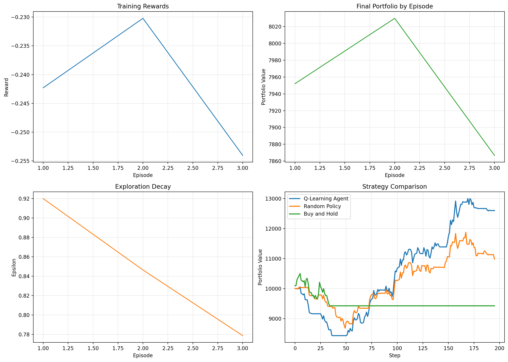

# Quant Bot AI

[](https://github.com/Ankurmishra05/QuantBot-AI/actions/workflows/ci.yml)
[](https://www.python.org/)
[](LICENSE)

Quant Bot AI is a reinforcement learning trading project built in Python. It trains and evaluates agents on historical market data, compares them against simple baselines, and saves artifacts for repeatable experiments.

The codebase started as an exploratory notebook and was refactored into a small, modular research project with a CLI, tests, CI, and reproducible outputs.

## What It Does

- Downloads and preprocesses historical market data with `yfinance`
- Builds engineered features from price, volume, returns, moving averages, and short-term volatility
- Trains a tabular Q-Learning baseline or an optional DQN agent
- Runs evaluation against random-policy and buy-and-hold benchmarks
- Applies practical trading constraints such as transaction costs, position sizing, stop-loss, take-profit, and max drawdown limits
- Saves metrics, model artifacts, and plots for each run

## Snapshot



## Project Layout

```text
quantbot_ai/
  agents.py
  config.py
  data.py
  envs.py
  main.py
  metrics.py
  plots.py
  training.py
docs/
  architecture.md
  project-notes.md
  assets/
notebooks/
  quantbot-ai-fin.ipynb
tests/
```

## Workflow

1. Load historical OHLCV data or generate synthetic data for an offline run.
2. Create normalized features for the trading state.
3. Train an agent inside a custom single-asset environment.
4. Evaluate the trained policy on a holdout split.
5. Compare the result with baseline strategies.
6. Save plots, metrics, and the trained model.

## Core Pieces

`Trading environment`

- Actions: `hold`, `buy`, `sell`
- State: engineered market features plus portfolio exposure
- Reward: step-over-step portfolio return
- Constraints: transaction costs, position sizing, stop-loss, take-profit, and drawdown guardrails

`Agents`

- `Q-Learning`: compact baseline with discretized state space and replay sampling
- `DQN`: small neural network with target-network synchronization and replay memory

`Evaluation`

- Final portfolio value
- Total return
- Volatility
- Sharpe ratio
- Max drawdown
- Risk events triggered during evaluation

## Installation

```bash
pip install -r requirements.txt
```

Optional editable install:

```bash
pip install -e .
```

## Usage

Train on synthetic data:

```bash
python -m quantbot_ai.main --use-synthetic-data --episodes 10
```

Train on historical data:

```bash
python -m quantbot_ai.main --ticker RELIANCE.NS --start-date 2018-01-01 --end-date 2025-01-01 --episodes 30
```

Run the DQN variant:

```bash
python -m quantbot_ai.main --use-synthetic-data --agent-type dqn --episodes 10
```

Run with tighter risk controls:

```bash
python -m quantbot_ai.main --use-synthetic-data --agent-type dqn --position-size-fraction 0.5 --stop-loss-pct 0.05 --take-profit-pct 0.15 --max-drawdown-limit 0.2
```

Artifacts are written to `artifacts/` by default.

## Quality

- Unit tests under [tests](/C:/Users/admin/New%20folder/QuantBot-AI/tests)
- GitHub Actions workflow in [.github/workflows/ci.yml](/C:/Users/admin/New%20folder/QuantBot-AI/.github/workflows/ci.yml)
- Docker support through [Dockerfile](/C:/Users/admin/New%20folder/QuantBot-AI/Dockerfile)

Run tests locally:

```bash
python -m unittest discover -s tests -v
```

Run with Docker:

```bash
docker build -t quantbot-ai .
docker run --rm quantbot-ai
```

## Notes

- [Architecture](/C:/Users/admin/New%20folder/QuantBot-AI/docs/architecture.md)
- [Project Notes](/C:/Users/admin/New%20folder/QuantBot-AI/docs/project-notes.md)

## License

MIT
